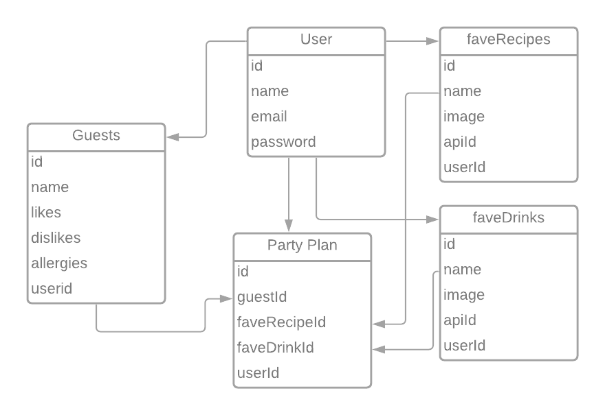

# App Title: Party Planner App

### App Demo: https://dinner-party-planner-app.herokuapp.com/

---

## Concept:

The Party Planner is a full-stack app designed to create a database of food and cocktail recipes, as well as any people you might want to invite. Set your menu and guests with just a few clicks.

---
## Technologies Used:

* App Build
  * Express
  * EJS
  * express-ejs-layouts
* Auth
  * bcrypt
  * passport
  * express-session
  * connect-flash
* Database management
  * postgres
  * sequelize
* APIs used
  * [spoonacular api](https://spoonacular.com/food-api)
  * [thecocktaildb api](https://www.thecocktaildb.com/api.php)


## Installation instructions:

1. Fork and clone the repo
2. Install dependencies
```
npm i
```

3. Create a `config.json` with the following code:
```json
{
  "development": {
    "database": "<insert development db name here>",
    "host": "127.0.0.1",
    "dialect": "postgres"
  },
  "test": {
    "database": "<insert test db name here>",
    "host": "127.0.0.1",
    "dialect": "postgres"
  },
  "production": {
    "database": "<insert production db name here>",
    "host": "127.0.0.1",
    "dialect": "postgres"
  }
}
```
**Note:** If your database requires a username and password you'll need to include these fields as well.

4. Create a database
```
sequelize db:create <insert db name here>
```

5. Migrate models to your database
```
sequelize db:migrate
```
6. Register at the [Spoonacular API](https://spoonacular.com/) to get your API key

7. Add `SESSION_SECRET` (any string), `PORT` (value of the host port), and `FOOD_KEY` (your Spoonacular API key) environment variables in a `.env` file.

8. Run `nodemon` to start up app

---
### ERD



---

### Wireframes


---


---


---


---


---
### User Stories
* As a user, I want to be able to search for food and cocktail recipes
* As a user, I want to search for recipes and save them to a list in order to access them later
* As a user, I want to add guests to a list and include likes, dislikes, and/or sensitivities/allergies
* As a user I want to flag saved guests and recipes to be displayed together on one page, and then go to that page to see my party plan.
---
 
 ### Development Plan

- [x] Access spoonacular and cocktaildb APIs and save recipes to app database, accessible only by logged in user. Create user-accessible guest list.
- [x] Add saved recipes/guests to a party plan, allowing the user to see all three elements on one page. 
- [ ] Expand features and improve styling to optimize UX/UI

### Stretch Goals
* Improve styling
* Modify code for accessibility
* Implement full CRUD functionality for saved recipes and cocktails.
* Allow for multiple instances of party plans that can be saved and displayed at will by the user.
* Develop functionality to flag food or drink in the party plan that match up to a guest's allergies/sensitivities.

---
### App Demo: https://dinner-party-planner-app.herokuapp.com/
